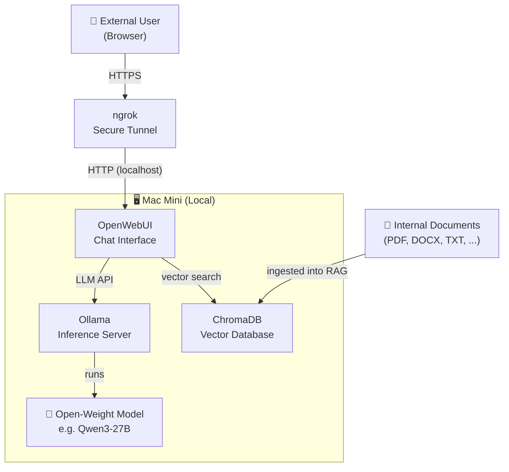

# Jane — Local LLM Setup

A self-hosted AI assistant running entirely on a Mac Mini, powered by open-weight models via Ollama and served through OpenWebUI with RAG capabilities.

## Architecture



## Data Flow

1. Internal documents are chunked, embedded, and stored in **ChromaDB**.
2. A user accesses **OpenWebUI** via the public ngrok URL.
3. OpenWebUI retrieves relevant document chunks from **ChromaDB** based on the user's query.
4. The query + retrieved context are sent to **Ollama**.
5. Ollama runs inference on the local model and streams the response back to the user.

## Components

| Component                  | Role                                                                                |
| -------------------------- | ----------------------------------------------------------------------------------- |
| **Ollama**                 | Runs open-weight LLMs locally with a simple HTTP API                                |
| **Qwen3-27B** (or similar) | The language model used for inference                                               |
| **OpenWebUI**              | Browser-based chat UI, manages conversations and RAG pipelines                      |
| **ChromaDB**               | Embedded vector database storing document embeddings for RAG                        |
| **ngrok**                  | Exposes the local OpenWebUI port to the public internet over HTTPS                  |
| **Internal Documents**     | Company/project documents ingested into ChromaDB for retrieval-augmented generation |

## Custom Agent which can be run in OpenWebUI: Medical History Intake Agent

We want to customize the chat capability of OpenWebUI to fit our special needs. Therefore we have created a LangGraph agent that guides a doctor through a structured patient intake interview.


### Tech Stack

| Component          | Role                                                           |
| ------------------ | -------------------------------------------------------------- |
| **FastAPI**        | Serves the agent as a REST API with streaming support          |
| **LangGraph**      | Orchestrates the stateful, multi-step agent flow               |
| **Ollama**         | Runs the local LLM for inference                               |
| **OpenWebUI Pipe** | Custom function that connects the FastAPI backend to OpenWebUI |

### Quick start

```bash
# 1. Create a virtual environment and install dependencies
python3 -m venv .venv && source .venv/bin/activate
pip install -r backend/requirements.txt

# 2. (Optional) Configure your Ollama model
cp backend/.env.example backend/.env
# Edit OLLAMA_MODEL / OLLAMA_BASE_URL as needed

# 3. Start the API server
uvicorn backend.main:app --reload --port 8000
```

State is persisted per-session via LangGraph's `MemorySaver` checkpointer.

Note: To update the flowchart, run

````

source .venv/bin/activate
python backend/agent.py

```
````
