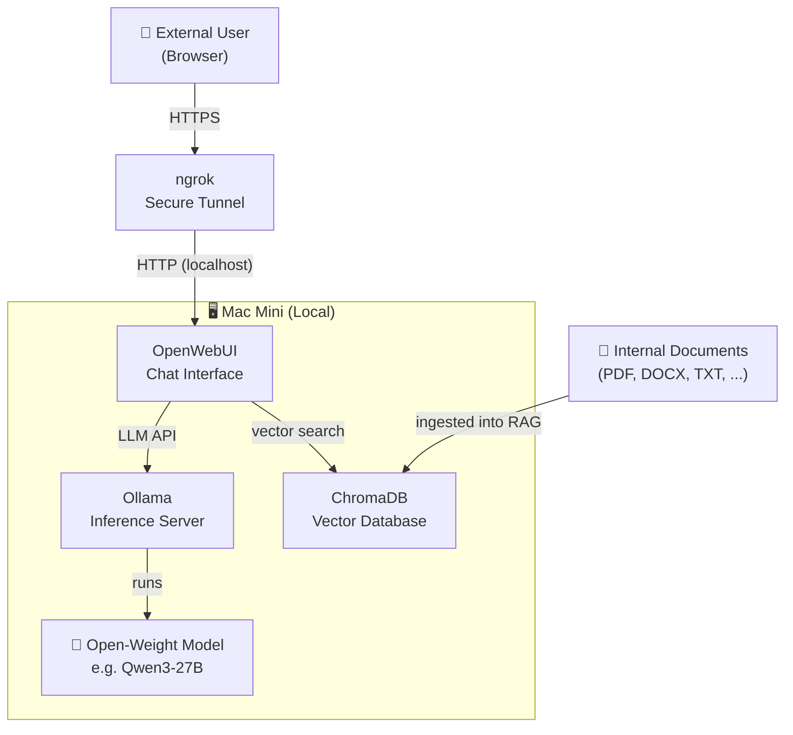

# Jane — Local LLM Setup

A self-hosted AI assistant running entirely on a Mac Mini, powered by open-weight models via Ollama and served through OpenWebUI with RAG capabilities.

## Architecture

## Components

| Component | Role |
|---|---|
| **Ollama** | Runs open-weight LLMs locally with a simple HTTP API |
| **Qwen3-27B** (or similar) | The language model used for inference |
| **OpenWebUI** | Browser-based chat UI, manages conversations and RAG pipelines |
| **ChromaDB** | Embedded vector database storing document embeddings for RAG |
| **ngrok** | Exposes the local OpenWebUI port to the public internet over HTTPS |
| **Internal Documents** | Company/project documents ingested into ChromaDB for retrieval-augmented generation |

## Data Flow

1. Internal documents are chunked, embedded, and stored in **ChromaDB**.
2. A user accesses **OpenWebUI** via the public ngrok URL.
3. OpenWebUI retrieves relevant document chunks from **ChromaDB** based on the user's query.
4. The query + retrieved context are sent to **Ollama**.
5. Ollama runs inference on the local model and streams the response back to the user.
