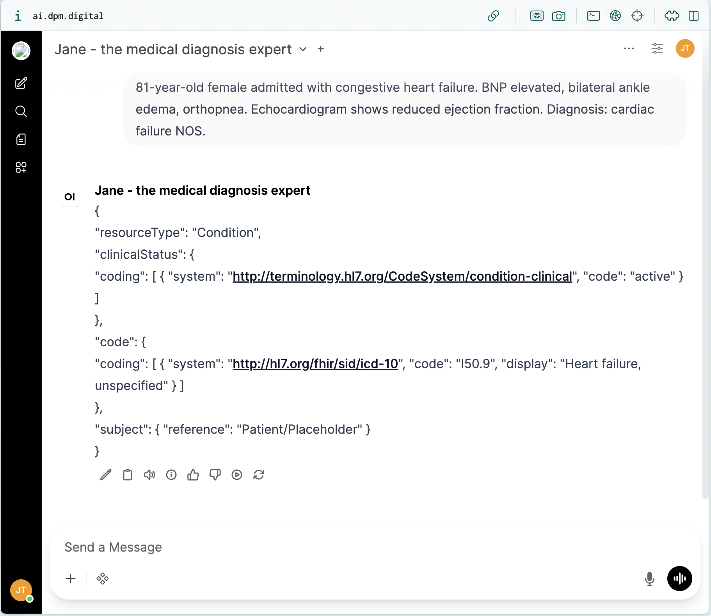
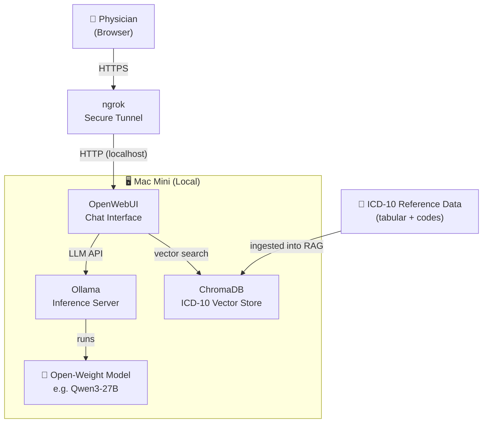
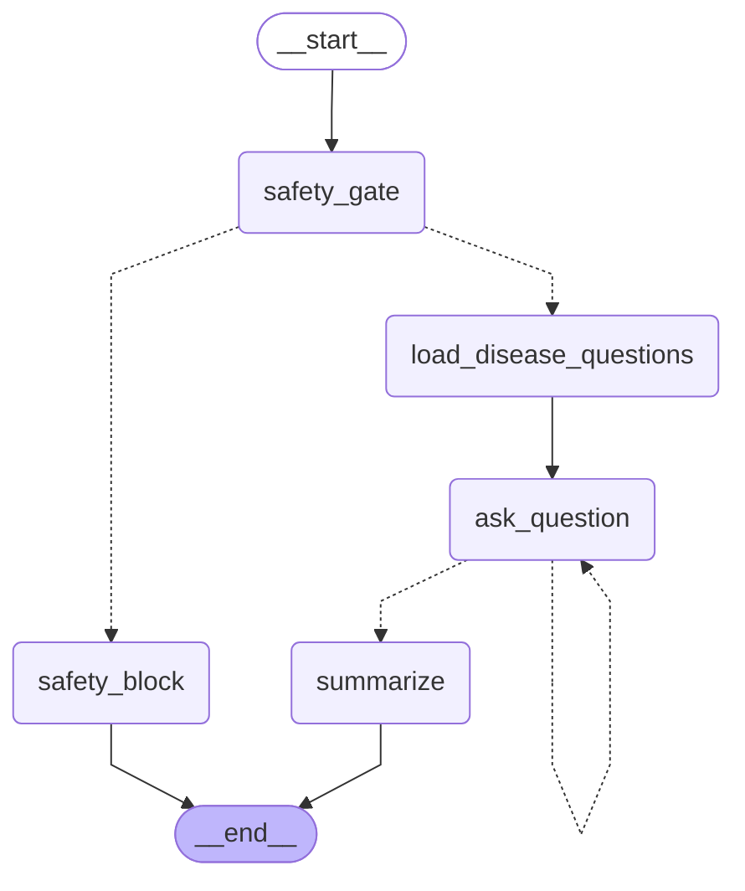
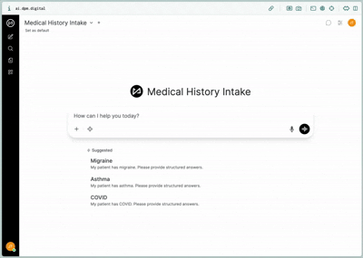

# Jane — Local Clinical Diagnosis Extractor

A self-hosted AI assistant that extracts diagnoses from unstructured clinical
notes and maps them to standardized **ICD-10 codes** — running entirely on
local infrastructure so patient data never leaves the internal network.

## The Problem

In clinical trials and hospital admin, physicians spend hours pulling
diagnoses from free-text notes and assigning ICD-10 codes for billing and
research. The work is slow, error-prone, and involves PHI that cannot leave
proprietary infrastructure.

## The Solution

A doctor pastes a raw clinical summary; Jane returns the primary diagnosis
as an ICD-10 code, with a link back to the official documentation justifying
that code — all served by an open-weight LLM running on a local Mac Mini.

### Example

> **Input:** _"Mr. Brown is 41 years of age... He was playing basketball when
> he felt a pop in his posterior leg. He was seen locally and diagnosed with
> an Achilles tendon rupture..."_
>
> **Output:** Right Achilles tendon rupture — **`S86.011A`**



## Architecture



### Data Flow

1. The official ICD-10 reference (`data/icd10*-2026.*`) is chunked,
   embedded, and stored in **ChromaDB**.
2. The physician pastes a clinical summary into **OpenWebUI** via the
   ngrok URL.
3. OpenWebUI retrieves candidate ICD-10 entries from **ChromaDB**.
4. The summary + retrieved codes are sent to **Ollama**.
5. The local model returns the primary diagnosis, the matching ICD-10
   code, and a link to its source entry.

### Components

| Component                  | Role                                                 |
| -------------------------- | ---------------------------------------------------- |
| **Ollama**                 | Runs open-weight LLMs locally with a simple HTTP API |
| **Qwen3-27B** (or similar) | The language model used for diagnosis extraction     |
| **OpenWebUI**              | Browser-based chat UI; orchestrates the RAG pipeline |
| **ChromaDB**               | Embedded vector database for ICD-10 retrieval        |
| **ngrok**                  | Exposes the local OpenWebUI port over HTTPS          |
| **ICD-10 Reference Data**  | Official 2026 tabular index ingested into ChromaDB   |

## Medical History Intake Agent

A LangGraph agent that augments the chat with a **structured patient
intake interview**, capturing the data needed to support coding decisions
and downstream clinical research.



A mandatory safety gate runs first; affirmative answers short-circuit the
interview with a legal-refusal message. State is persisted per session via
LangGraph's `MemorySaver` checkpointer.



### Tech Stack

| Component          | Role                                                           |
| ------------------ | -------------------------------------------------------------- |
| **FastAPI**        | Serves the agent as a REST API with streaming support          |
| **LangGraph**      | Orchestrates the stateful, multi-step agent flow               |
| **Ollama**         | Runs the local LLM for inference                               |
| **OpenWebUI Pipe** | Custom function that connects the FastAPI backend to OpenWebUI |

## Quick Start

```bash
# 1. Create a virtual environment and install dependencies
python3 -m venv .venv && source .venv/bin/activate
pip install -r backend/requirements.txt

# 2. (Optional) Configure your Ollama model
cp backend/.env.example backend/.env
# Edit OLLAMA_MODEL / OLLAMA_BASE_URL as needed

# 3. Start the API server
uvicorn backend.main:app --reload --port 8000
```

To regenerate the agent flowchart:

```bash
source .venv/bin/activate
python backend/agent.py
```

## AI Cost comparison tool

We have created a small tool to compare different infrastructure setups based on their expected costs. This should facilitate decision making from a financial perspective as well.

The simulator can be viewed at https://dieproduktmacher.github.io/hackathon-jane-local-llm/
